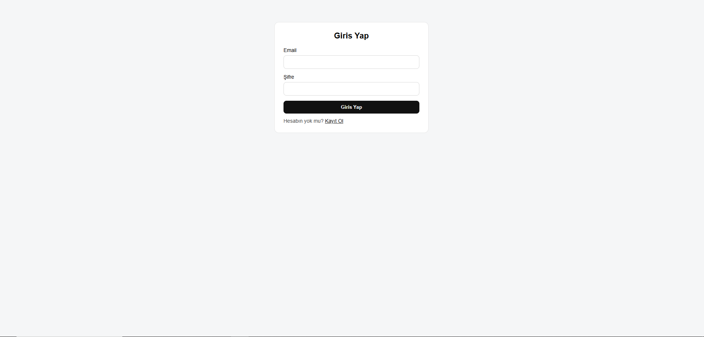
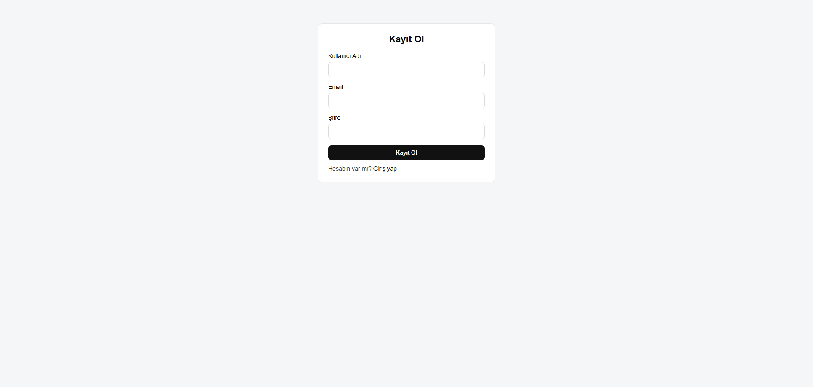
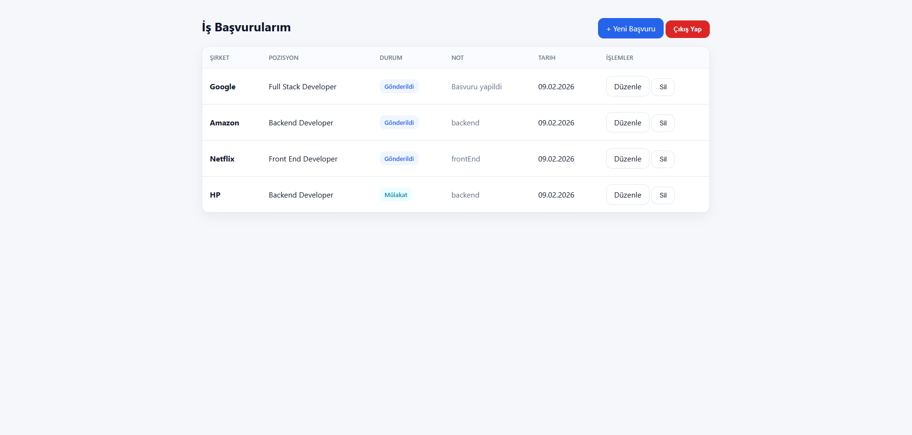
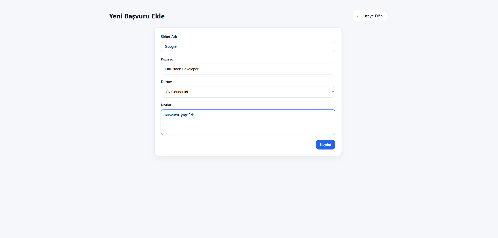
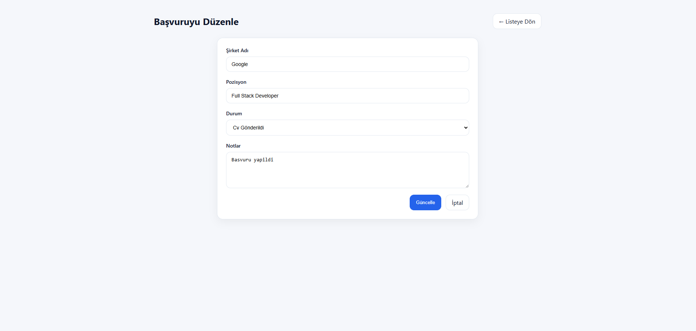

# 🚀 Job Tracker – Node.js Job Application Management App

A full-stack web application that allows users to track and manage their job applications in an organized way.  
Built with Node.js, Express, MongoDB, and EJS using an MVC-like architecture.

This project demonstrates backend development skills including authentication, authorization, CRUD operations, and server-side rendering.

---

## 📌 Project Purpose

While applying for jobs, it becomes difficult to remember:

- Which companies you applied to  
- Current status of applications  
- Interview notes  
- Follow-up details  

This application was created to solve that problem with a simple and practical interface.

---

## ✨ Features

### 🔐 Authentication System
- User registration & login
- Password hashing with bcrypt
- JWT-based authentication
- Secure token stored in HTTP-only cookies
- Protected routes using middleware
- Logout functionality

### 📋 Job Application Management (CRUD)
- Create new job applications  
- Edit existing records  
- Delete applications  
- Track status with predefined values:
  - Cv Gonderildi  
  - Red  
  - Mulakat  

### 👤 User-Based Access Control
- Each user can only access their own job records  
- Secure MongoDB queries using user ID validation  

### 🖥 Server-Side Rendering
- Dynamic pages rendered with EJS templates  

### ⚙ Technical Features
- Method override support for PUT/DELETE requests  
- Organized project structure  
- Middleware-based authentication  
- Environment variable configuration  
- MongoDB connection handling  

---

## 🛠 Tech Stack

- **Backend:** Node.js, Express.js  
- **Database:** MongoDB, Mongoose  
- **Templating:** EJS  
- **Auth:** JWT (jsonwebtoken), bcrypt  
- **Utilities:** cookie-parser, method-override, morgan  
- **Frontend:** HTML, CSS  

---

---

## 📸 Application Screenshots

### Login Page


### Register Page


### Job List Page


### Add New Job


### Edit Job Page


---


## 🗂 Project Structure

```
JOBTRACKER/
├── config/
│   └── db.js
├── controllers/
│   ├── authController.js
│   └── jobController.js
├── middlewares/
│   └── authMiddleware.js
├── models/
│   ├── User.js
│   └── Jobs.js
├── public/
│   └── css/
├── routes/
│   ├── authRoutes.js
│   └── jobRoutes.js
├── views/
├── screenshots/
├── app.js
├── package.json
├── .gitignore
└── .env.example
```

---

## 🚀 Getting Started

### 1) Clone the Repository

```
git clone https://github.com/EmirBaranKadirhan/job-tracker.git
cd job-tracker
```

### 2) Install Dependencies

```
npm install
```

### 3) Configure Environment Variables

Create a `.env` file in the project root:

```
MONGO_URI=mongodb://127.0.0.1:27017/jobtracker
PORT=3000
JWT_SECRET=your_secret_key
```

Example configuration is provided in `.env.example`

---

### 4) Run the Application

```
npm start
```

Then open in your browser:

```
http://localhost:3000
```

---

## 🛣 Routes Overview

### Auth Routes

- GET /auth/register  
- POST /auth/register  
- GET /auth/login  
- POST /auth/login  
- POST /auth/logout  

### Job Routes (Protected)

- GET /index  
- GET /newJob  
- POST /newJob  
- GET /editJob/:id  
- PUT /editJob/:id  
- DELETE /index/:id  

---

## 🔒 Security Measures

- JWT stored as HTTP-only cookies  
- Passwords hashed with bcrypt  
- Protected routes via middleware  
- User-specific database queries  
- Environment variables for secrets  
- `.env` file excluded from GitHub  

---

## 🧪 What This Project Demonstrates

This project shows my ability to:

- Build a full-stack Node.js application  
- Implement authentication and authorization  
- Use MongoDB with Mongoose  
- Create CRUD functionality  
- Structure a project cleanly  
- Work with JWT and cookies  
- Develop protected routes  

---

## 📈 Future Improvements

- Flash messages and validation  
- Pagination and search  
- CSRF protection  
- Improved UI/UX  
- Better error pages  
- HTTPS-ready cookie settings  

---

## 👨‍💻 Author

**Emir Baran Kadırhan**

GitHub: https://github.com/EmirBaranKadirhan

---

## 📄 License

This project is open-source and available under the MIT License.
